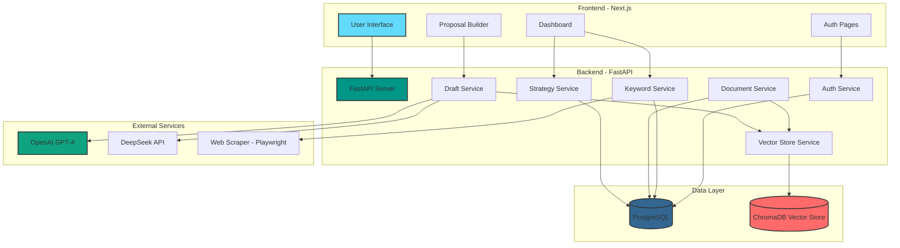

# System Architecture Diagram

This Mermaid diagram shows the high-level architecture of the Auto Bidder platform.

## Architecture Overview

## Component Descriptions

### Frontend Layer
- **User Interface**: React-based UI built with Next.js 15 and shadcn/ui
- **Auth Pages**: Login/Signup with JWT authentication
- **Dashboard**: Project management, keyword tracking, strategy configuration
- **Proposal Builder**: Interactive proposal generation interface

### Backend Layer
- **FastAPI Server**: Main API gateway with async request handling
- **Auth Service**: JWT token management and user authentication
- **Keyword Service**: Keyword extraction and competitive analysis
- **Document Service**: Knowledge base document management
- **Draft Service**: AI-powered proposal generation
- **Strategy Service**: Bidding strategy configuration
- **Vector Store Service**: RAG-based semantic search

### Data Layer
- **PostgreSQL**: Primary relational database for structured data
- **ChromaDB**: Vector database for embeddings and semantic search

### External Services
- **OpenAI GPT-4**: Primary LLM for proposal generation
- **DeepSeek API**: Alternative LLM provider
- **Web Scraper**: Playwright-based scraper for competitive intelligence
