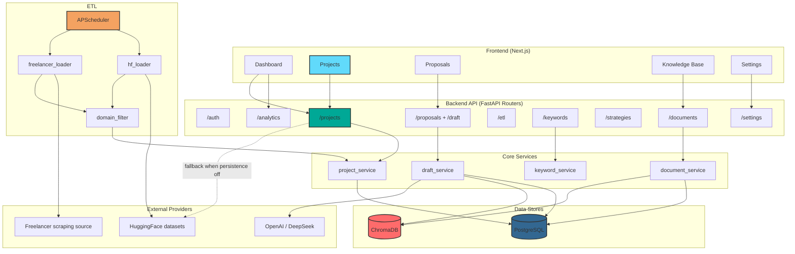

# System Architecture Diagram

This Mermaid diagram shows the current high-level architecture of the Auto Bidder platform, including the dual Projects data paths (database persistence vs direct HuggingFace fallback).

## Architecture Overview

## Component Descriptions

### Notes

- `ETL_USE_PERSISTENCE=true`: Projects list/discover read and write through PostgreSQL via project service.
- `ETL_USE_PERSISTENCE=false`: Projects fallback can fetch directly from HuggingFace service for list/discover.
- Knowledge Base and proposal generation use PostgreSQL + ChromaDB together (metadata + vector retrieval).
- ETL scheduler can run both HF and Freelancer ingestion pipelines.
