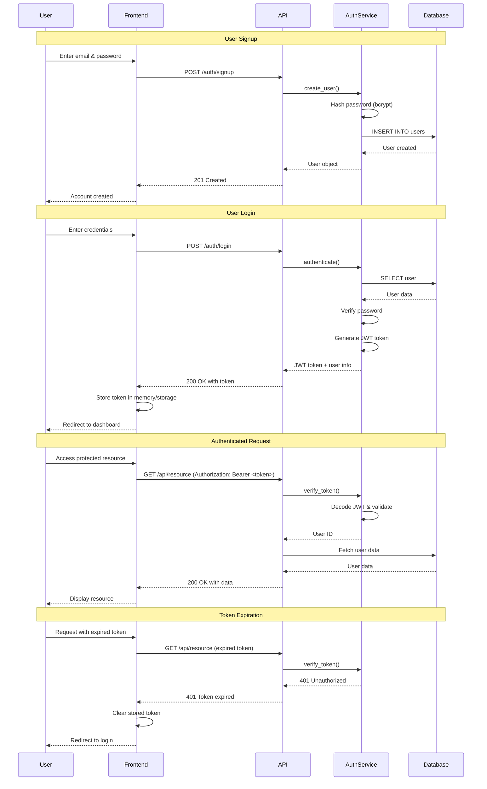

# Authentication Flow Diagram

This diagram shows the complete authentication flow in the Auto Bidder platform.

## Authentication Flow



## Key Security Features

1. **Password Hashing**: bcrypt with automatic salt generation
2. **JWT Tokens**: Stateless authentication with configurable expiration
3. **Token Validation**: Every protected endpoint validates JWT signature
4. **Secure Storage**: Passwords truncated to 72 bytes for bcrypt compatibility
5. **Error Handling**: Generic error messages to prevent user enumeration

## Token Structure

```json
{
  "sub": "user_id",
  "exp": 1234567890,
  "iat": 1234567000
}
```

## Environment Configuration

- `JWT_SECRET`: Cryptographically secure 64-byte secret
- `JWT_ALGORITHM`: HS256 (HMAC with SHA-256)
- `ACCESS_TOKEN_EXPIRE_MINUTES`: Token lifetime (default: 30 days)
