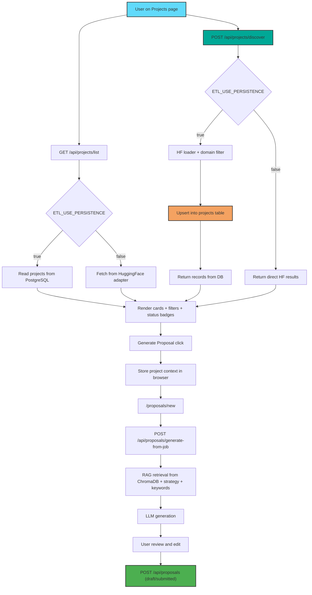

# Projects and Proposal Workflow

This diagram reflects the implemented path from project discovery/listing to proposal generation and submission.

## Workflow Overview

## Detailed Stages

### 1. List and Discover

- `list` is the default browse/search path.
- `discover` is explicit fetch for new opportunities.
- In persistence mode, discover upserts then list reads stable DB state.

### 2. Project Context Transfer

- Selected project context is passed into Proposals flow.
- Applied IDs prevent accidental repeat application actions.

### 3. AI Proposal Generation

- Knowledge Base retrieval (ChromaDB) + strategy + keywords + job requirements.
- LLM returns generated sections for editing.

### 4. Save and Submit

- Draft and submitted proposals persist to database tables.
- Proposal records are then used by analytics and applied-state signals.

## Related Docs

- [projects.md](../projects.md)
- [proposals.md](../proposals.md)
- [huggingface-job-discovery.md](../huggingface-job-discovery.md)
