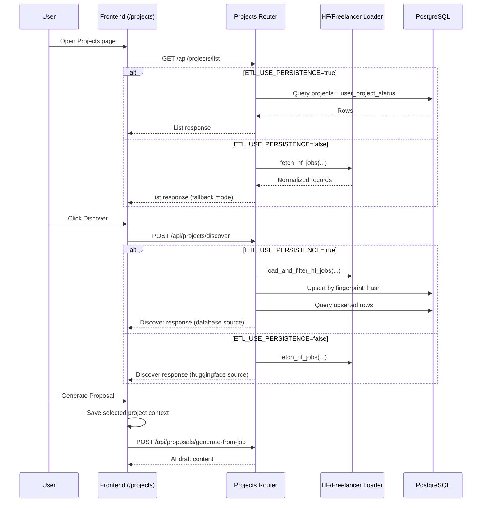

# Projects Page - User Guide and Implementation Notes

Last Updated: March 2026

This page explains how Projects actually works today, including the differences between list/search and discover, when database tables are touched, and how to combine multiple data sources (HuggingFace, Freelancer, and others).

## Quick Summary

- The Projects UI has two data paths: list/search and discover.
- With ETL persistence enabled, Projects is database-first and stable.
- With ETL persistence disabled, Projects uses direct HuggingFace fetches and can vary between reloads.
- Discover can be transient in non-persistent mode because results are held in frontend state.

Related diagrams:
- [diagrams/workflow-diagram.md](./diagrams/workflow-diagram.md)
- [diagrams/architecture-diagram.md](./diagrams/architecture-diagram.md)

## Projects API Sequence



## Projects Dataflow (Merged)

```mermaid
flowchart TB
	subgraph Sources
		HF[HuggingFace datasets]
		FL[Freelancer scraper output]
		MAN[Manual project form]
	end

	subgraph ETL_and_Normalization
		HFL[hf_loader]
		FLL[freelancer_loader]
		DF[domain_filter]
		NR[normalize to JobRecord]
		FP[fingerprint_hash generation]
	end

	subgraph Persistence
		UPS[upsert_projects/upsert_jobs]
		P[(projects table)]
		ER[(etl_runs table)]
		UPS_STATUS[(user_project_status)]
	end

	subgraph ReadPaths
		LIST[GET /api/projects/list]
		DISC[POST /api/projects/discover]
		STATS[GET /api/projects/stats]
		GETONE[GET /api/projects/{id}]
	end

	HF --> HFL --> DF --> NR --> FP --> UPS
	FL --> FLL --> DF
	MAN --> UPS

	UPS --> P
	HFL --> ER
	FLL --> ER

	DISC -->|persistence on| HFL
	DISC -->|persistence on| UPS
	DISC -->|persistence off| HF

	LIST -->|persistence on| P
	LIST -->|persistence off| HF
	LIST -->|merge manual in fallback| P

	STATS --> P
	GETONE --> P

	UPS_STATUS --> P
```

## How Projects Load Today

### General loading (`/api/projects/list`)

On page load and on Search/filter actions, the frontend calls `GET /api/projects/list`.

Behavior depends on environment:

1. Persistence mode (`ETL_USE_PERSISTENCE=true`)
- Reads from PostgreSQL `projects` table.
- Applies server-side filters (search/platform/category/status/applied/sort/pagination).
- Uses stable DB records, so reloads are generally consistent.

2. Non-persistence mode (`ETL_USE_PERSISTENCE=false`)
- Fetches data directly from HuggingFace source adapter.
- Merges in manual projects from DB when available.
- Sorts in-memory and paginates afterward.
- Results can drift between reloads due to source variability and synthetic timestamps in some dataset mappings.

### Discover (`/api/projects/discover`)

Discover means "fetch new opportunities by keyword/dataset now."

1. Persistence mode
- Loads + normalizes + domain-filters records.
- Upserts into `projects` table (dedupe by fingerprint hash).
- Returns rows from DB, including user status context.

2. Non-persistence mode
- Fetches from HuggingFace and returns response directly.
- No DB upsert for those discovered rows.
- Frontend stores discover results in local state override for current session view.

## Discover vs General Load

| Aspect | General load (`list`) | Discover (`discover`) |
|---|---|---|
| Purpose | Browse existing project pool with filters | Pull new records by ad hoc keywords/dataset |
| Trigger | Initial page load + Search + pagination | Discover modal submit |
| Persistence mode | Reads from DB | Writes to DB (upsert), then reads back |
| Non-persistence mode | Fetches from HF adapter | Fetches from HF adapter |
| DB writes | None for list itself | Only in persistence mode |
| UX behavior | Replaces list with query results | Temporarily overrides visible list in UI |

## Why You Sometimes See Different Projects On Reload

In non-persistence mode:

1. Data is fetched from HF at request time, not from a frozen local table.
2. Some normalized records use generated recent timestamps when source posted date is missing.
3. List endpoint sorts by date in fallback mode, so ordering can shift.
4. Pagination occurs after sorting, so page 1 contents can change.
5. Discover results are stored in component state and are reset on full reload.

## Database Touch Points: When Tables Are Read or Written

### Read-only scenarios (no project table mutation)

- `GET /api/projects/list` in persistence mode: reads from `projects` (+ optional `user_project_status` join).
- `GET /api/projects/list` in non-persistence mode: HF fetch + optional read of manual records from DB.
- `GET /api/projects/stats`: reads aggregates.
- `GET /api/projects/{id}`: read-only lookup (persistence mode).

### Write scenarios (CRUD)

1. Discover in persistence mode
- Upsert into `projects` by `fingerprint_hash`.
- Existing rows can be updated with latest title/description/skills/budget/source metadata.

2. ETL jobs
- HF ingestion and Freelancer ingestion write to `projects` via same upsert path.
- ETL run audit writes to `etl_runs`.

3. Manual project actions
- `POST /api/projects/manual` inserts a manual row.
- `DELETE /api/projects/manual/{project_id}` removes a manual row.

4. Project status updates
- `PUT /api/projects/{id}/status` writes to `user_project_status` per user-project pair.

## How To Combine HuggingFace, Freelancer, and Other Sources

Recommended architecture: unified ETL into one `projects` table.

### Current capability

- HuggingFace loader exists.
- Freelancer loader exists.
- Scheduler can run both.
- Shared upsert service deduplicates and normalizes records.

### Implementation pattern for any new source

1. Build source adapter
- Fetch raw records from source API/scraper/dataset.

2. Normalize to internal `JobRecord`
- Fill platform, external_id, title, description, skills, budgets, posted_at, raw_payload.

3. Apply domain filter
- Keep only target domain categories before DB write.

4. Upsert into unified table
- Use `upsert_jobs`/`upsert_projects` with deterministic fingerprint.

5. Expose via existing list/stats endpoints
- UI remains unchanged because list endpoint already supports multi-platform data.

### Practical migration plan

1. Set `ETL_USE_PERSISTENCE=true` in production-like environments.
2. Keep `USE_HF_DATASET=true` for HF source availability.
3. Run HF ETL on schedule for base pool.
4. Run Freelancer ETL on schedule for live additions.
5. Add future source loaders (Upwork, LinkedIn, etc.) using same contract.
6. Keep source-specific metadata in `etl_source` + `raw_payload` for traceability.

## User Tips

- Use Discover for targeted pulls when trying new keywords or a different dataset.
- Use Search for fast narrowing over your current project pool.
- If results feel unstable, switch to persistence mode and rely on ETL ingestion.
- Use active keywords to improve default list relevance when search box is empty.
- Use source badges to understand where each card came from.

## FAQ

### Is "general loading" the same as "Discover"?

No. General loading queries the current pool. Discover actively fetches new records.

### How do I merge multiple datasets and sources?

Ingest each source through the ETL normalization + upsert pipeline so all records land in the same `projects` table.

### Does loading Projects modify DB tables?

Usually no. `list` and `stats` are read paths. Writes occur during ETL/discover (persistence mode), manual create/delete, and status updates.

### Why do cards show HuggingFace even when I expected Freelancer?

Check ETL schedule and recent `etl_runs`. Also verify platform normalization allows your source platform value.
