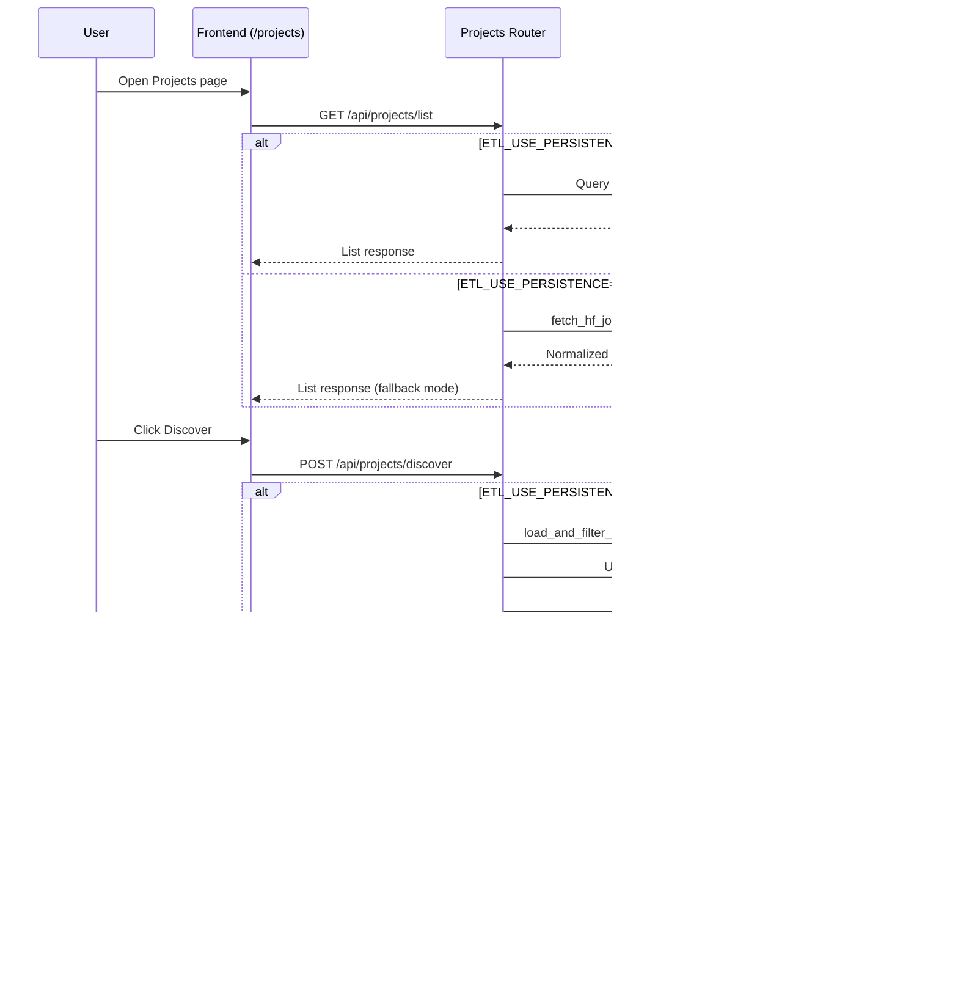

# Projects Page - User Guide and Implementation Notes

Last Updated: March 2026

This page explains how Projects actually works today, including the differences between list/search and discover, when database tables are touched, and how to combine multiple data sources (HuggingFace, Freelancer, and others).

## Quick Summary

- The Projects UI has two data paths: list/search and discover.
- With ETL persistence enabled, Projects is database-first and stable.
- With ETL persistence disabled, Projects uses direct HuggingFace fetches and can vary between reloads.
- Discover can be transient in non-persistent mode because results are held in frontend state.

Related diagrams:
- [diagrams/workflow-diagram.md](./diagrams/workflow-diagram.md)
- [diagrams/architecture-diagram.md](./diagrams/architecture-diagram.md)

## Projects API Sequence


```mermaid
sequenceDiagram
	participant U as User
	participant FE as Frontend (/projects)
	participant API as Projects Router
	participant ETL as HF/Freelancer Loader
	participant DB as PostgreSQL

	U->>FE: Open Projects page
	FE->>API: GET /api/projects/list
	alt ETL_USE_PERSISTENCE=true
		API->>DB: Query projects + user_project_status
		DB-->>API: Rows
		API-->>FE: List response
	else ETL_USE_PERSISTENCE=false
		API->>ETL: fetch_hf_jobs(...)
		ETL-->>API: Normalized records
		API-->>FE: List response (fallback mode)
	end

	U->>FE: Click Discover
	FE->>API: POST /api/projects/discover
	alt ETL_USE_PERSISTENCE=true
		API->>ETL: load_and_filter_hf_jobs(...)
		API->>DB: Upsert by fingerprint_hash
		API->>DB: Query upserted rows
		API-->>FE: Discover response (database source)
	else ETL_USE_PERSISTENCE=false
		API->>ETL: fetch_hf_jobs(...)
		API-->>FE: Discover response (huggingface source)
	end

	U->>FE: Generate Proposal
	FE->>FE: Save selected project context
	FE->>API: POST /api/proposals/generate-from-job
	API-->>FE: AI draft content
```

## Projects Dataflow (Merged)

```mermaid
flowchart TB
	subgraph Sources
		HF[HuggingFace datasets]
		FL[Freelancer scraper output]
		MAN[Manual project form]
	end

	subgraph ETL_and_Normalization
		HFL[hf_loader]
		FLL[freelancer_loader]
		DF[domain_filter]
		NR[normalize to JobRecord]
		FP[fingerprint_hash generation]
	end

	subgraph Persistence
		UPS[upsert_projects/upsert_jobs]
		P[(projects table)]
		ER[(etl_runs table)]
		UPS_STATUS[(user_project_status)]
	end

	subgraph ReadPaths
		LIST[GET /api/projects/list]
		DISC[POST /api/projects/discover]
		STATS[GET /api/projects/stats]
		GETONE[GET /api/projects/{id}]
	end

	HF --> HFL --> DF --> NR --> FP --> UPS
	FL --> FLL --> DF
	MAN --> UPS

	UPS --> P
	HFL --> ER
	FLL --> ER

	DISC -->|persistence on| HFL
	DISC -->|persistence on| UPS
	DISC -->|persistence off| HF

	LIST -->|persistence on| P
	LIST -->|persistence off| HF
	LIST -->|merge manual in fallback| P

	STATS --> P
	GETONE --> P

	UPS_STATUS --> P
```

## How Projects Load Today

### General loading (`/api/projects/list`)

On page load and on Search/filter actions, the frontend calls `GET /api/projects/list`.

Behavior depends on environment:

1. Persistence mode (`ETL_USE_PERSISTENCE=true`)
- Reads from PostgreSQL `projects` table.
- Applies server-side filters (search/platform/category/status/applied/sort/pagination).
- Uses stable DB records, so reloads are generally consistent.

2. Non-persistence mode (`ETL_USE_PERSISTENCE=false`)
- Fetches data directly from HuggingFace source adapter.
- Merges in manual projects from DB when available.
- Sorts in-memory and paginates afterward.
- Results can drift between reloads due to source variability and synthetic timestamps in some dataset mappings.

### Discover (`/api/projects/discover`)

Discover means "fetch new opportunities by keyword/dataset now."

1. Persistence mode
- Loads + normalizes + domain-filters records.
- Upserts into `projects` table (dedupe by fingerprint hash).
- Returns rows from DB, including user status context.

2. Non-persistence mode
- Fetches from HuggingFace and returns response directly.
- No DB upsert for those discovered rows.
- Frontend stores discover results in local state override for current session view.

## Discover vs General Load

| Aspect | General load (`list`) | Discover (`discover`) |
|---|---|---|
| Purpose | Browse existing project pool with filters | Pull new records by ad hoc keywords/dataset |
| Trigger | Initial page load + Search + pagination | Discover modal submit |
| Persistence mode | Reads from DB | Writes to DB (upsert), then reads back |
| Non-persistence mode | Fetches from HF adapter | Fetches from HF adapter |
| DB writes | None for list itself | Only in persistence mode |
| UX behavior | Replaces list with query results | Temporarily overrides visible list in UI |

## Why You Sometimes See Different Projects On Reload

In non-persistence mode:

1. Data is fetched from HF at request time, not from a frozen local table.
2. Some normalized records use generated recent timestamps when source posted date is missing.
3. List endpoint sorts by date in fallback mode, so ordering can shift.
4. Pagination occurs after sorting, so page 1 contents can change.
5. Discover results are stored in component state and are reset on full reload.

## Database Touch Points: When Tables Are Read or Written

### Read-only scenarios (no project table mutation)

- `GET /api/projects/list` in persistence mode: reads from `projects` (+ optional `user_project_status` join).
- `GET /api/projects/list` in non-persistence mode: HF fetch + optional read of manual records from DB.
- `GET /api/projects/stats`: reads aggregates.
- `GET /api/projects/{id}`: read-only lookup (persistence mode).

### Write scenarios (CRUD)

1. Discover in persistence mode
- Upsert into `projects` by `fingerprint_hash`.
- Existing rows can be updated with latest title/description/skills/budget/source metadata.

2. ETL jobs
- HF ingestion and Freelancer ingestion write to `projects` via same upsert path.
- ETL run audit writes to `etl_runs`.

3. Manual project actions
- `POST /api/projects/manual` inserts a manual row.
- `DELETE /api/projects/manual/{project_id}` removes a manual row.

4. Project status updates
- `PUT /api/projects/{id}/status` writes to `user_project_status` per user-project pair.

## How To Combine HuggingFace, Freelancer, and Other Sources

Recommended architecture: unified ETL into one `projects` table.

### Current capability

- HuggingFace loader exists.
- Freelancer loader exists.
- Scheduler can run both.
- Shared upsert service deduplicates and normalizes records.

### Implementation pattern for any new source

1. Build source adapter
- Fetch raw records from source API/scraper/dataset.

2. Normalize to internal `JobRecord`
- Fill platform, external_id, title, description, skills, budgets, posted_at, raw_payload.

3. Apply domain filter
- Keep only target domain categories before DB write.

4. Upsert into unified table
- Use `upsert_jobs`/`upsert_projects` with deterministic fingerprint.

5. Expose via existing list/stats endpoints
- UI remains unchanged because list endpoint already supports multi-platform data.

### Practical migration plan

1. Set `ETL_USE_PERSISTENCE=true` in production-like environments.
2. Keep `USE_HF_DATASET=true` for HF source availability.
3. Run HF ETL on schedule for base pool.
4. Run Freelancer ETL on schedule for live additions.
5. Add future source loaders (Upwork, LinkedIn, etc.) using same contract.
6. Keep source-specific metadata in `etl_source` + `raw_payload` for traceability.

## User Tips

- Use Discover for targeted pulls when trying new keywords or a different dataset.
- Use Search for fast narrowing over your current project pool.
- If results feel unstable, switch to persistence mode and rely on ETL ingestion.
- Use active keywords to improve default list relevance when search box is empty.
- Use source badges to understand where each card came from.

---

## Multi-Source Architecture

The platform uses a **Source Adapter Registry** pattern — each data source (HF dataset, Freelancer, manual upload) has one adapter class that maps its raw schema to a canonical `JobRecord`:

| Source | Adapter | Status |
|--------|---------|--------|
| `jacob-hugging-face/job-descriptions` | `JacobHFAdapter` | ✅ Production |
| `lukebarousse/data_jobs` | `LukeBarousseAdapter` | ✅ Production |
| `datastax/linkedin_job_listings` | `DatastaxLinkedInAdapter` | ✅ Production |
| Freelancer (scraped JSON) | `FreelancerAdapter` | ✅ Production |
| Manual upload (JSON/CSV) | `ManualUploadAdapter` | ✅ Production |

**Env config** — `HF_DATASET_IDS` (comma-separated) takes priority over `HF_DATASET_ID`. Resolution: `HF_DATASET_IDS` → `HF_DATASET_ID` → hardcoded default.

**Adding a new source** = one adapter class + one registry line. See `backend/app/etl/source_adapters.py`.

---

## Future: Web Scraping (Optional)

Real web scraping (Upwork, Freelancer, etc.) is **planned but not yet implemented**. The platform uses HuggingFace datasets for job discovery.

| Approach | Status |
|----------|--------|
| **HuggingFace datasets** | ✅ Implemented |
| **Web scraping** | ❌ Not implemented |

**What exists (preparation only):**
- DB schema: `scraping_jobs`, `platform_credentials` in migrations
- Error class: `ScrapingError` in `backend/app/core/errors.py`
- Dependencies: playwright, beautifulsoup4, lxml in requirements.txt

**What's missing:**
- No `scraper_service.py`, no scraping API routes
- No Upwork/Freelancer scrapers, no background workers

**Recommendation:** Continue using HuggingFace. Add scraping only if production requires live platform job feeds.

---

---

## HuggingFace Dataset Integration

**Purpose:** Replace Crawlee web scraping with HuggingFace datasets for faster development  
**Status:** ✅ COMPLETE - Production Ready

### Why This Approach

The scraping layer (Crawlee) feeds job postings into the backend's job discovery pipeline. HuggingFace datasets serve as a **static seed/mock data source** that emits the same job-shaped records, so the rest of the pipeline (RAG, proposal generation, analytics) runs **unchanged**.

**Benefits:**
- ✅ **No scraping complexity** - No proxies, anti-bot detection, rate limits
- ✅ **Instant data access** - 30K+ jobs available immediately
- ✅ **Same API interface** - Drop-in replacement for Crawlee
- ✅ **Real job data** - Actual job postings from Google, LinkedIn, etc.
- ✅ **Reproducible** - Same dataset for all developers
- ✅ **Cost-free** - No API fees or infrastructure costs

**Time Saved:** 2-3 weeks of scraper development

### Feature Flag Pattern

```python
USE_HF_DATASET = os.getenv("USE_HF_DATASET", "true").lower() == "true"

if USE_HF_DATASET:
    jobs = await fetch_hf_jobs(keywords)  # HuggingFace
else:
    jobs = await scrape_jobs(keywords)    # Web scraping (future)
```

### Available Datasets

| Dataset | Size | Fields | Recommended |
|---------|------|--------|:-----------:|
| `jacob-hugging-face/job-descriptions` | 5,000+ | Title, Company, Description, Skills | ⭐ Yes |
| `lukebarousse/data_jobs` | 30,000+ | Title, Company, Salary, Skills | For analytics |
| `debasmitamukherjee/IT_job_postings` | 10,000+ | Description, Skills | For IT roles |
| `nakamoto-yama/linkedin_job_postings` | Varies | Company info, job details | For LinkedIn data |

### Configuration

```bash
# HuggingFace Dataset Configuration
USE_HF_DATASET=true
HF_DATASET_ID=jacob-hugging-face/job-descriptions
HF_DATASET_IDS=jacob-hugging-face/job-descriptions,lukebarousse/data_jobs,datastax/linkedin_job_listings
HF_JOB_LIMIT=200
```

`HF_DATASET_IDS` (comma-separated) takes priority over `HF_DATASET_ID`. Resolution: `HF_DATASET_IDS` → `HF_DATASET_ID` → hardcoded default.

### ETL Scheduler Guide

Two ways to run ETL ingestion: **from the UI** or **from CLI scripts**.

#### 1. From the UI (Backend Running)

When the backend is running with `ETL_USE_PERSISTENCE=true`:

**Automatic scheduled runs:**
- **HF datasets**: Runs every `HF_ETL_SCHEDULE_HOURS` (default 168 = weekly)
- **Freelancer**: Runs every `FREELANCER_ETL_SCHEDULE_HOURS` (default 24 = daily)

The scheduler starts automatically on backend startup. No extra setup.

**Manual trigger:**
```bash
curl -X POST http://localhost:5555/api/etl/trigger \
  -H "Authorization: Bearer $TOKEN" \
  -H "Content-Type: application/json" \
  -d '{"source": "hf_loader"}'
# or
  -d '{"source": "freelancer_loader"}'
```

Returns `202 Accepted`; ingestion runs in the background.

**View run history:**
```bash
curl -H "Authorization: Bearer $TOKEN" \
  "http://localhost:5555/api/etl/runs?limit=20"
```

#### 2. From CLI Scripts (Cron / Airflow)

**HuggingFace ETL:**
```bash
cd backend && uv run python scripts/hf_etl.py --dataset-id jacob-hugging-face/job-descriptions --limit 200
cd backend && uv run python scripts/hf_etl.py --keywords "python,fastapi" --limit 50
cd backend && uv run python scripts/hf_etl.py --output data/scraped/hf_$(date +%Y%m%d).json --no-db
```

**Freelancer ETL:**
```bash
cd backend && uv run python scripts/freelancer_etl.py --keywords "python,fastapi" --limit 20
cd backend && uv run python scripts/freelancer_etl.py --load-from ../data/scraped/freelancer_20260305_151834.json
cd backend && uv run python scripts/freelancer_etl.py --scrape-only --keywords "python" --limit 10
```

**Cron entries:**
```cron
# HF weekly (Sunday 2am)
0 2 * * 0 cd /path/to/auto-bidder/backend && uv run python scripts/hf_etl.py >> /var/log/hf_etl.log 2>&1

# Freelancer daily (3am)
0 3 * * * cd /path/to/auto-bidder/backend && uv run python scripts/freelancer_etl.py --keywords "python,fastapi,react" >> /var/log/freelancer_etl.log 2>&1
```

#### Environment

| Variable | Default | Description |
|----------|---------|-------------|
| `ETL_USE_PERSISTENCE` | false | Enable scheduler + DB reads in backend |
| `HF_ETL_SCHEDULE_HOURS` | 168 | HF ingestion interval (hours) |
| `FREELANCER_ETL_SCHEDULE_HOURS` | 24 | Freelancer ingestion interval (hours) |

### Architecture & Data Flow

```
User Action (Click "Discover Jobs")
    ↓
Frontend: API Client → POST /api/projects/discover
    ↓
Backend: HF Service → HuggingFace Datasets API (streaming)
    ↓
Normalize & Filter → Return to Frontend (JSON)
    ↓
Display in UI (ProjectCard components)
```

### API Endpoints

**Discover Jobs:**
```bash
POST /api/projects/discover
Authorization: Bearer <token>
{
  "keywords": ["python", "fastapi", "react"],
  "max_results": 50,
  "dataset_id": "jacob-hugging-face/job-descriptions"
}
```

**Get Statistics:**
```bash
GET /api/projects/stats
Authorization: Bearer <token>
```

**Available Datasets:**
```bash
GET /api/projects/datasets
Authorization: Bearer <token>
```

### Core Service: hf_job_source.py

The service handles multiple dataset formats with intelligent field mapping:

- `normalize_hf_job(record, dataset_id)` — Maps raw HF dataset row → internal Job dict
- `fetch_hf_jobs(dataset_id, split, limit, keyword_filter)` — Loads jobs from HF dataset
- `search_hf_jobs(keywords, limit)` — Searches for jobs matching keywords

**Streaming Mode:** For large datasets (30K+), uses `load_dataset(..., streaming=True)` to avoid memory issues.

### Migration Path

| Phase | Config | Purpose |
|-------|--------|---------|
| **Phase 0 (Current)** | `USE_HF_DATASET=true` | Develop with mock data |
| **Phase 1 (Future)** | `USE_HF_DATASET=false` | Add real web scraping |
| **Production** | `USE_HF_DATASET=false`, `HF_FALLBACK=true` | Hybrid approach |

---

## FAQ

### Is "general loading" the same as "Discover"?

No. General loading queries the current pool. Discover actively fetches new records.

### How do I merge multiple datasets and sources?

Ingest each source through the ETL normalization + upsert pipeline so all records land in the same `projects` table.

### Does loading Projects modify DB tables?

Usually no. `list` and `stats` are read paths. Writes occur during ETL/discover (persistence mode), manual create/delete, and status updates.

### Why do cards show HuggingFace even when I expected Freelancer?

Check ETL schedule and recent `etl_runs`. Also verify platform normalization allows your source platform value.
