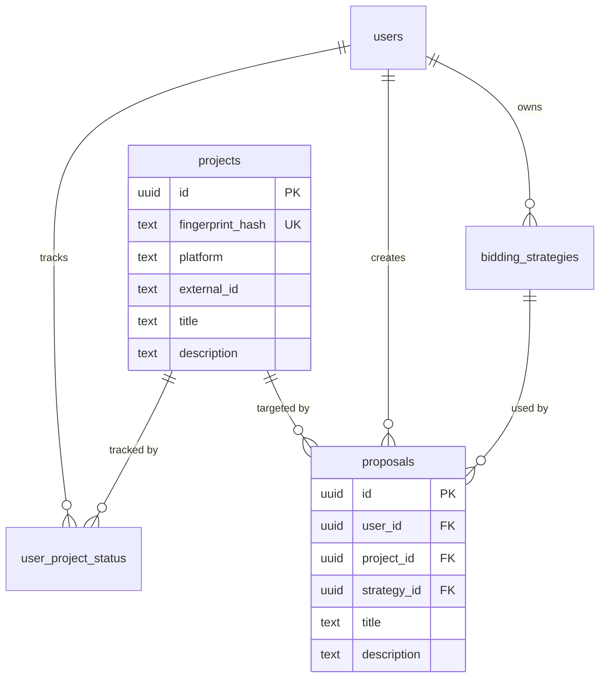

# Data Model: Refactored Schema (Post-005)

**Feature**: 005-refactor-pg-database  
**Date**: 2026-03-07

## Nav-to-Table Mapping

| UI Nav         | Route           | Primary Table(s)              | Group    |
|----------------|-----------------|-------------------------------|----------|
| Dashboard      | /dashboard      | Aggregates (multiple)          | —        |
| Projects       | /projects       | **projects** (renamed from jobs) | Resources |
| Proposals      | /proposals      | **proposals**                 | Bidders  |
| Knowledge Base | /knowledge-base | knowledge_base_documents      | Resources |
| Strategies     | /strategies     | bidding_strategies            | Bidders  |
| Keywords       | /keywords       | keywords                      | Resources |
| Analytics      | /analytics      | workflow_analytics, analytics_events | Resources |
| Settings       | /settings       | user_profiles, platform_credentials | Resources |

**Backend-only (no nav)**: etl_runs, user_session_states, draft_work, scraping_jobs

---

## Removed Tables

| Table     | Reason |
|-----------|--------|
| projects  | Legacy; replaced by renamed jobs → projects |
| bids      | Redundant with proposals; linked to legacy projects |

---

## Entity: projects (formerly jobs)

**Purpose**: Job listings from ETL (HuggingFace, Freelancer). Source of truth for Projects nav.

| Column          | Type           | Purpose |
|-----------------|----------------|---------|
| id              | uuid PK        | Primary key |
| fingerprint_hash | text UNIQUE   | Dedup key (platform + external_id) |
| platform        | job_platform    | upwork, freelancer, huggingface_dataset, etc. |
| external_id     | text           | Platform job ID |
| external_url    | text           | Optional URL |
| category        | job_category   | ai_ml, web_development, etc. |
| subcategory     | text           | Optional |
| title           | text           | Job title |
| description     | text           | Full description |
| skills_required | text[]         | Required skills |
| budget_min, budget_max | numeric | Budget range |
| budget_currency | char(3)       | Default USD |
| employer_name   | text           | Client name |
| status          | job_status     | new, matched, archived, expired |
| etl_source      | text           | hf_loader, freelancer_scheduler, etc. |
| raw_payload     | jsonb          | Optional raw ETL data |
| posted_at       | timestamptz    | When job was posted |
| scraped_at      | timestamptz    | When ingested |
| created_at, updated_at | timestamptz | Metadata |

**Relationships**:
- user_job_status.project_id → projects.id (was job_id → jobs.id)
- proposals.project_id → projects.id (was job_id → jobs.id)

---

## Entity: user_project_status (formerly user_job_status)

**Purpose**: Per-user pipeline status on projects (reviewed, applied, won, lost).

| Column    | Type    | Purpose |
|-----------|---------|---------|
| id        | uuid PK | Primary key |
| user_id   | uuid FK | → users.id |
| project_id| uuid FK | → projects.id (renamed from job_id) |
| status    | varchar | reviewed, applied, won, lost, archived |
| created_at, updated_at | timestamptz | Metadata |

**Unique**: (user_id, project_id)

---

## Entity: proposals

**Purpose**: User-created proposals for projects. Single table for Proposals nav.

| Column           | Type    | Purpose |
|------------------|---------|---------|
| id               | uuid PK | Primary key |
| user_id          | uuid FK | → users.id |
| project_id       | uuid FK | → projects.id (renamed from job_id) |
| strategy_id      | uuid FK | → bidding_strategies.id |
| title, description | text  | Proposal content |
| budget, timeline | —       | Optional |
| status           | varchar | draft, submitted, accepted, rejected, withdrawn |
| generated_with_ai | boolean | AI-generated flag |
| created_at, updated_at | timestamptz | Metadata |

---

## Entity: etl_runs

**Purpose**: ETL audit trail. No nav mapping.

| Column           | Type    | Purpose |
|------------------|---------|---------|
| id               | serial PK | Primary key |
| source          | text    | hf_etl_script, freelancer_scheduler, etc. |
| started_at, completed_at | timestamptz | Run window |
| status          | text    | success, failed, running |
| jobs_extracted, jobs_filtered, jobs_inserted, jobs_updated | int | Counts |
| error_message   | text    | On failure |
| metadata        | jsonb   | Optional |

*Note: Column names "jobs_*" retained; optional rename to "projects_*" in follow-up.*

---

## Resources Group

- **projects**: Job listings (Projects nav)
- **keywords**: User search terms (Keywords nav)
- **knowledge_base_documents**: Uploaded docs (Knowledge Base nav)
- **workflow_analytics**, **analytics_events**: (Analytics nav)
- **user_profiles**, **platform_credentials**: (Settings nav)

## Bidders Group

- **proposals**: User proposals (Proposals nav)
- **bidding_strategies**: AI configs (Strategies nav)

---

## ER Diagram (Simplified)

